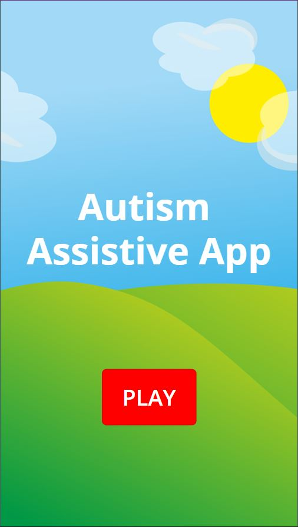
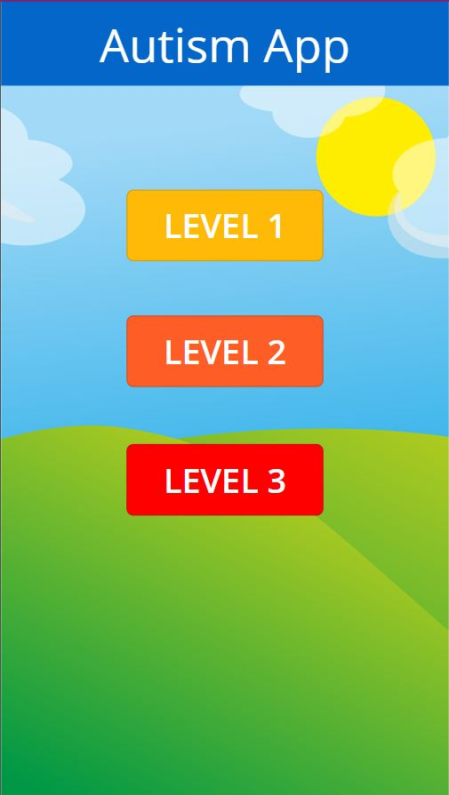
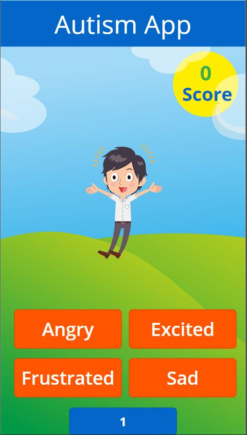
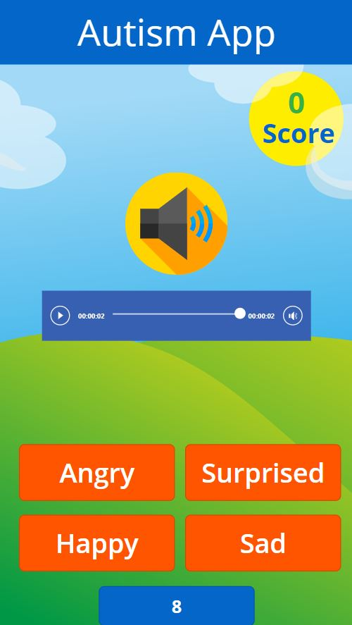
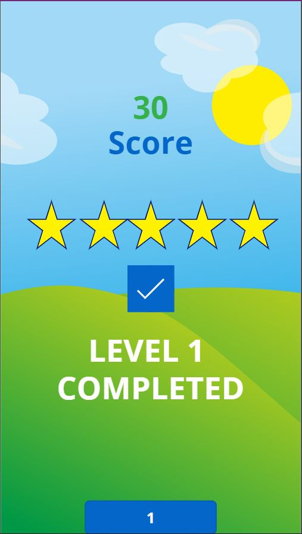

# Autism Assistive System

## Background
According to the World Health Organization, 1 in 160 children has an autism spectrum disorder.
These children struggle with social interactions on a daily basis. ASD significantly limits their capacity to conduct daily activities and participate in social scenarios. It also imposes significant emotional burden on children with these disorders.

## Problem statement
  Develop a technology-based solution for children suffering from ASD to help them in interacting better in social scenarios, hence making social environments more accessible,     and inclusive for them.
  
## Description of the solution
Our app aims at improving emotional intelligence of the users (suffering from autism) by Gamifying the process.
The game is divided into 3 levels where each level challenges the user to decipher the emotion reflected on the screen through:
* Images (Level 1)
* Audio (Level 2)
* Video (Level 3)

As the game progresses, the difficulty level increases. 
To increase the difficulty level even further, we plan to incorporate the following into the game:
* Various Social Scenarios (Ex- School, Playground, Cafe)
* Characters belonging to diverse set of Age Groups

## Images

  
Home Screen

  

  
Level Screen

  

  
Level 1

  

  
Level 2

  

  
Level Complete

  

## Future Scope
* Add an Avatar feature.
* Add user authentication of parents/doctors for tracking children's progress.
* Feature: Children interpret emotions associated with personalized content uploaded by parents.
* Feature: Parents where they can create personalized teaching stories.
* Add parental control functionalities to set playing time limit.

## Technologies Used
* Microsoft Azure Power Apps Platform
* <b>Future Tech stack:</b> Deploying a website as well for the product, using Web App Service on Microsoft Azure.

## Team Members
   
  &nbsp;&nbsp;&nbsp;
[Satvik Chachra](https://www.github.com/satvikchachra)&nbsp;&nbsp;&nbsp;&nbsp;&nbsp;&nbsp;&nbsp;&nbsp;&nbsp;&nbsp;&nbsp;&nbsp;
[Pranav Gurditta](https://www.github.com/anshwalia)&nbsp;&nbsp;&nbsp;&nbsp;&nbsp;&nbsp;&nbsp;&nbsp;&nbsp;&nbsp;&nbsp;
[Vedant Bahel](https://www.github.com/vedantbahel)&nbsp;&nbsp;&nbsp;&nbsp;&nbsp;&nbsp;&nbsp;&nbsp;&nbsp;&nbsp;&nbsp;&nbsp;
[Rucha Yagnik](https://www.github.com/RuchaYagnik)&nbsp;&nbsp;&nbsp;&nbsp;&nbsp;&nbsp;&nbsp;&nbsp;&nbsp;&nbsp;&nbsp;&nbsp;&nbsp;&nbsp;&nbsp;&nbsp;

## References
* https://www.autismspeaks.org/what-are-symptoms-autism
* https://www.who.int/news-room/fact-sheets/detail/autism-spectrum-disorders
