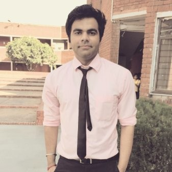

# Autism Assistive System

# Background
According to the World Health Organization, 1 in 160 children has an autism spectrum disorder.
These children struggle with social interactions on a daily basis. ASD significantly limits their capacity to conduct daily activities and participate in social scenarios. It also imposes significant emotional burden on children with these disorders.

# Technologies Used
* Microsoft Azure Power Apps Platform
* <b>Future Tech stack:</b> Deploying a website as well for the product, using Web App Service on Microsoft Azure.

# Problem statement
  Develop a technology-based solution for children suffering from ASD to help them in interacting better in social scenarios, hence making social environments more accessible,     and inclusive for them.
  
# Description of the solution
  What does the application do ?
  Kids suffering from Autism are not able to decipher the emotions of other people around them, so our application tries to teach them in a fun loving way
  using a game based format about emotions the people are feeling in different scenarios like playground, classroom and restaurant.
  
  Kids suffering from Autism find it difficult to understand what is the emotion associated with a particular voice, hence we try to teach as well as quiz the kid    	whether the sound being played is associated with happiness, sadness, anger or fear.
  
### Story

# Future Scope
* Add a feature for Parents where they can create personalized teaching stories for certain social scenarios by clicking pictures. Examples - how to interact at a restaurant or when working on a project in a group and many more.
* Build a feature where parents can add audio content for their children to learn to interpret emotions associated with the audio.
* Add user authentication.
* Add an Avatar feature.
* Add parental control functionalities to set playing time limit.
* Add audio content.
	
### Team Members
   
  &nbsp;&nbsp;&nbsp;
[Satvik Chachra](https://www.github.com/satvikchachra)&nbsp;&nbsp;&nbsp;&nbsp;&nbsp;&nbsp;&nbsp;&nbsp;&nbsp;&nbsp;&nbsp;&nbsp;
[Pranav Gurditta](https://www.github.com/anshwalia)&nbsp;&nbsp;&nbsp;&nbsp;&nbsp;&nbsp;&nbsp;&nbsp;&nbsp;&nbsp;&nbsp;
[Vedant Bahel](https://www.github.com/vedantbahel)&nbsp;&nbsp;&nbsp;&nbsp;&nbsp;&nbsp;&nbsp;&nbsp;&nbsp;&nbsp;&nbsp;&nbsp;
[Rucha Yagnik](https://www.github.com/RuchaYagnik)&nbsp;&nbsp;&nbsp;&nbsp;&nbsp;&nbsp;&nbsp;&nbsp;&nbsp;&nbsp;&nbsp;&nbsp;&nbsp;&nbsp;&nbsp;&nbsp;

# References
* https://www.autismspeaks.org/what-autism
* https://www.who.int/news-room/fact-sheets/detail/autism-spectrum-disorders#:~:text=It%20is%20estimated%20that%20worldwide,figures%20that%20are%20substantially%20higher.
